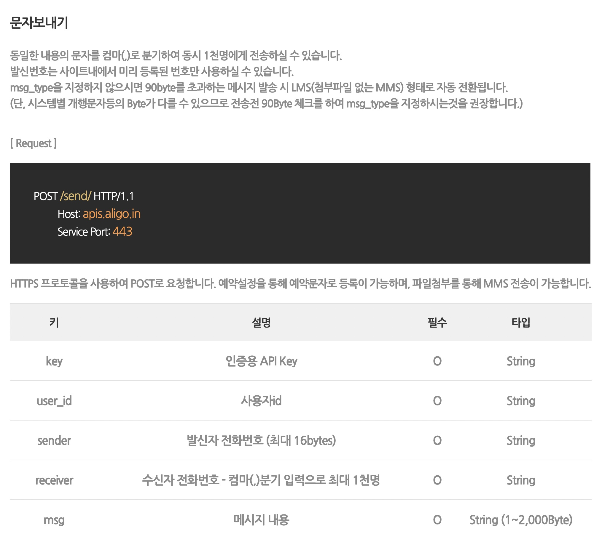

# 알리고 문자 발신 테스트
> 아래 이미지 대로 진행하면 됨


### [알리고 문자보내기 API 메뉴얼](https://smartsms.aligo.in/admin/api/spec.html)


`API Key` `SenderKey`
```
API Key와 SenderKey는 최강민이 갖고 있겠음
```

### 파워오토메이트 Flow Body
```
key=000&user_id=000&sender=000&receiver=@{triggerBody()?['text_1']}&msg=@{triggerBody()?['text']}님 안녕하세요. 해달에듀 자동화 시스템 테스트 중입니다.
```