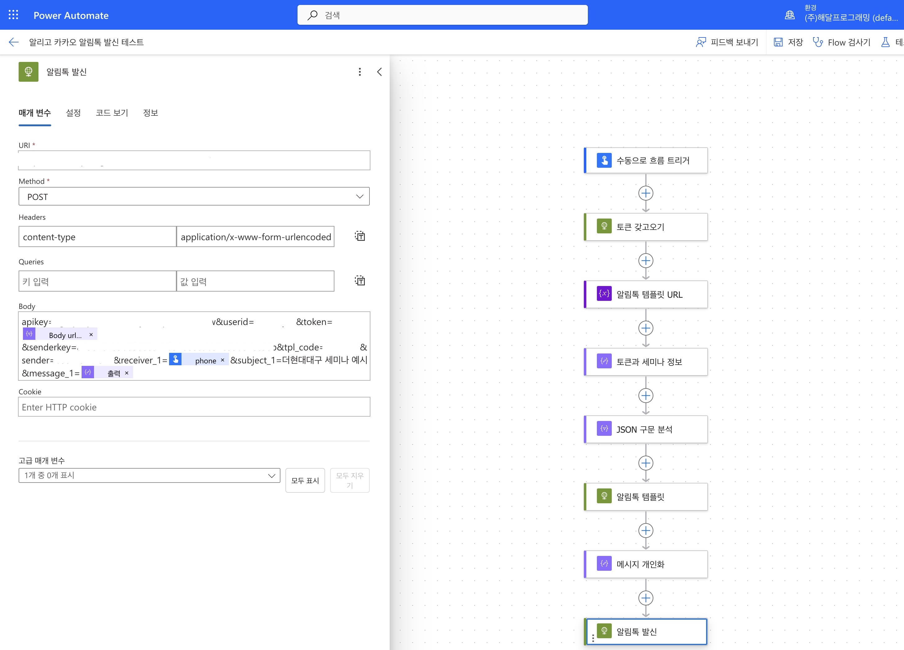
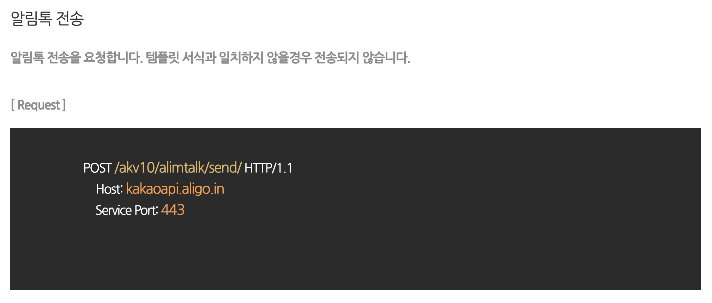
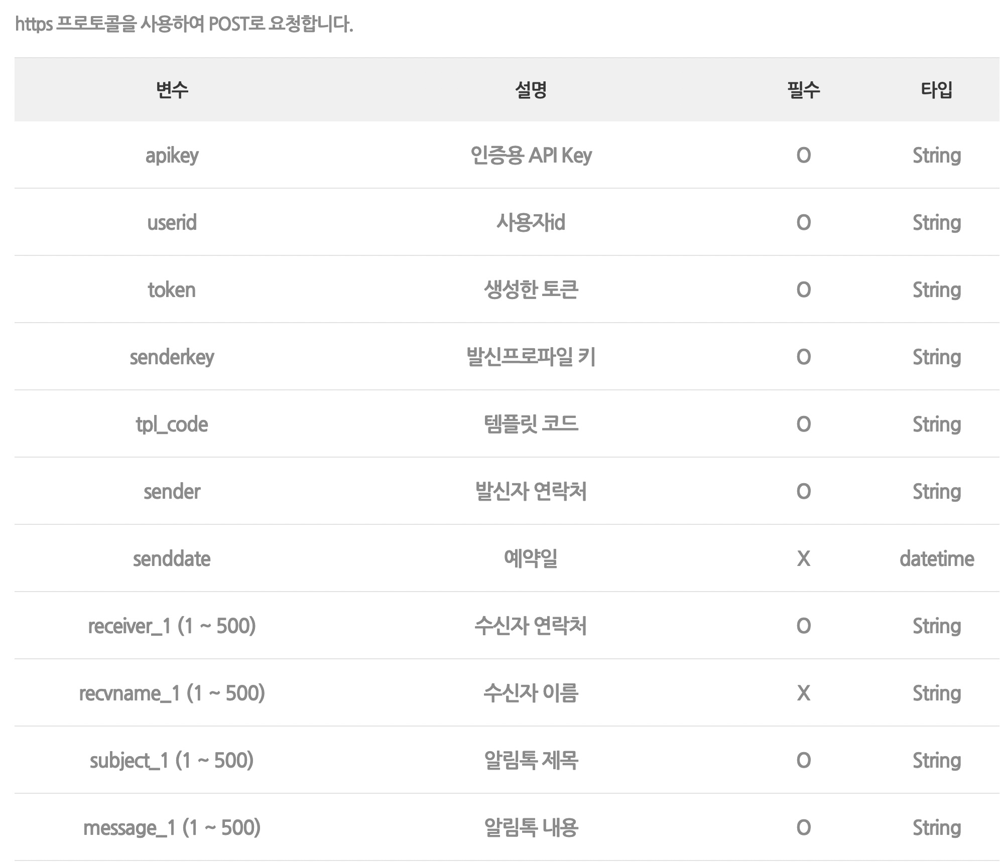
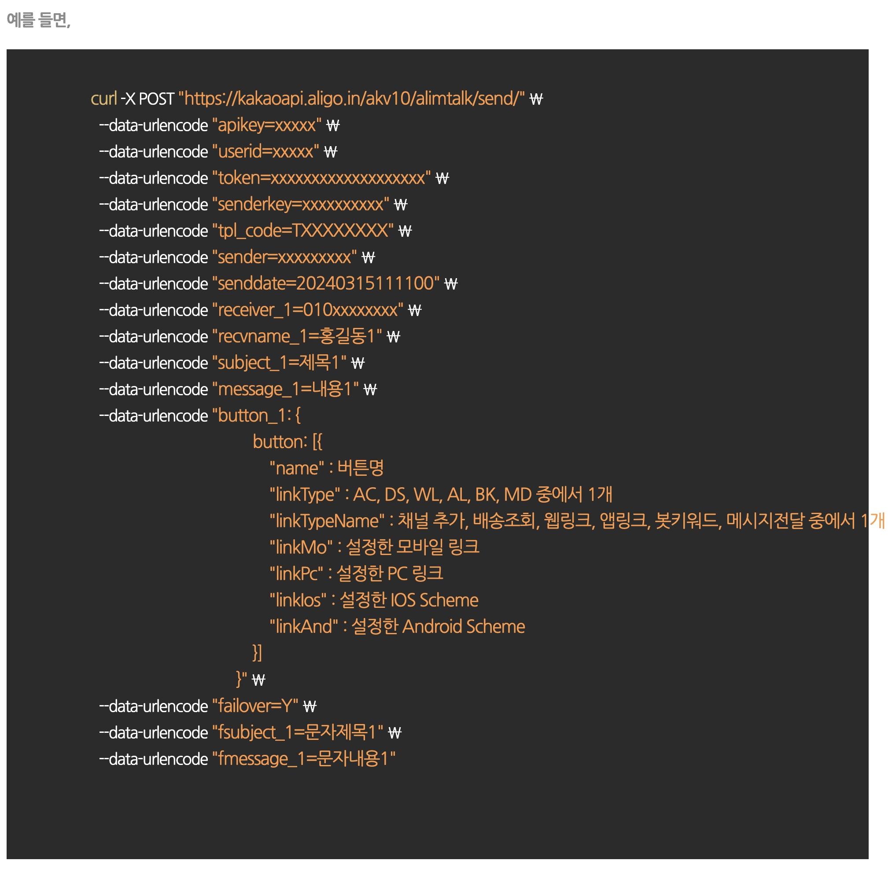
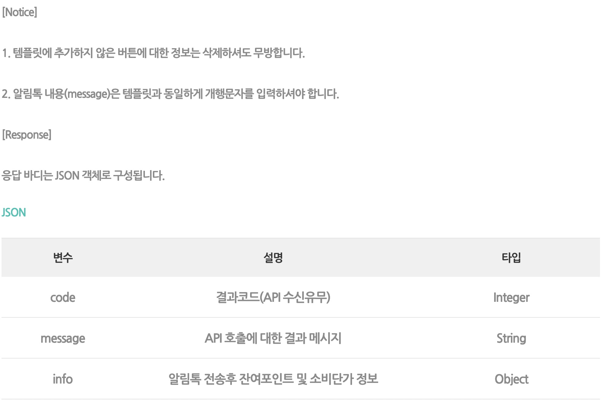
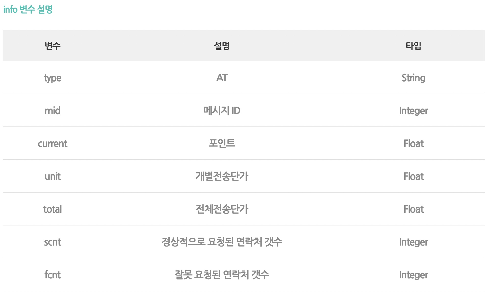
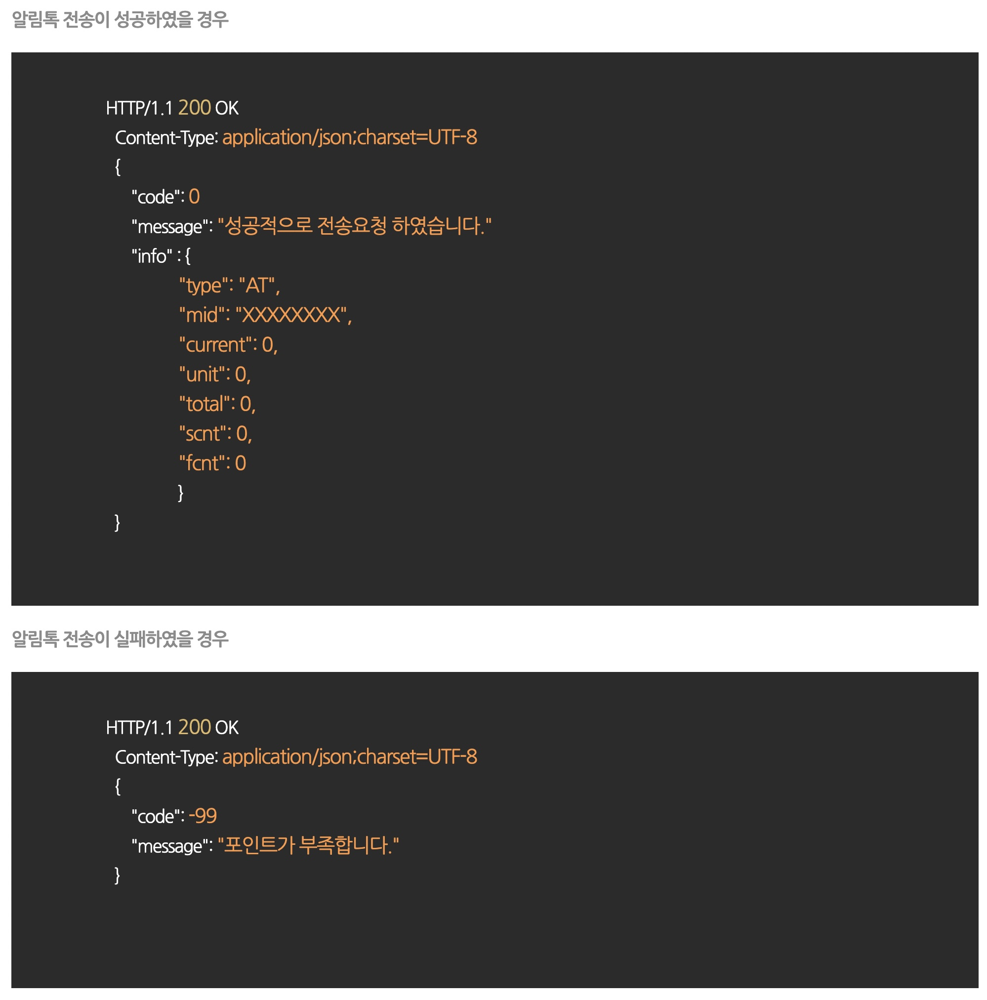

# 알리고 카카오 알림톡 발신 테스트
> 아래 이미지 대로 진행하면 됨



### [알리고 알림톡 API 메뉴얼](https://smartsms.aligo.in/shop/kakaoapispec.html)













### 파워오토메이트 Flow
보내고 싶은 문구
```
[더현대 대구 코딩교육세미나]
안녕하세요 #{자녀_이름} 학부모님
더현대 대구 코딩교육세미나를 신청해주셔서 감사합니다.

세미나는 사전 예약제로 운영되고 있어 아래 계좌로 참가비 입금을 부탁드립니다. 입금 확인 후 세미나 예약 확정을 도와드리겠습니다:)

일시: #{세미나_일시}
장소: #{세미나_장소}
참가비: #{세미나_참가비}
문의: 053-252-4512

※ 예약금 입금 계좌 : IBK 기업은행 152-119640-04-017(해달아이티스페이스)
*예금주명은 '#{자녀_이름}'으로 부탁 드립니다. 학부모님 성함으로 이체할 시 꼭 연락 부탁 드립니다.

감사합니다
```
파워오토메이트 Flow Body
```
apikey=000&userid=000&token=000&senderkey=000&tpl_code=000&sender=000&receiver_1=000&&subject_1=000&message_1=000
```
현재 구조에선 `token` 에 `urlencode` 넣어야 함